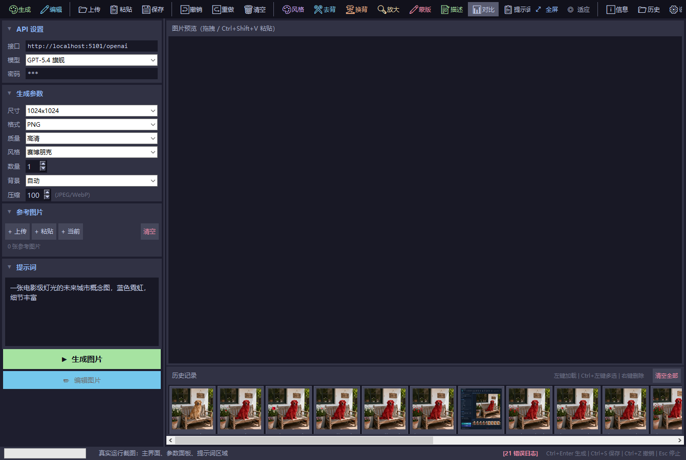
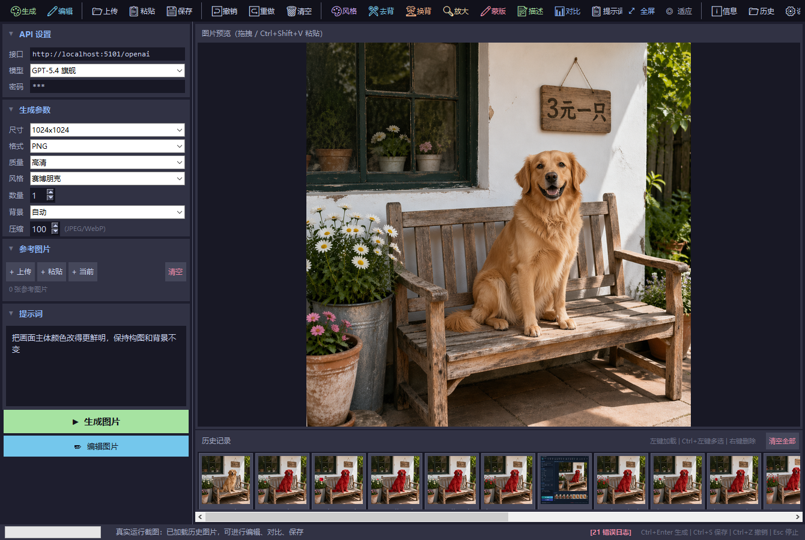
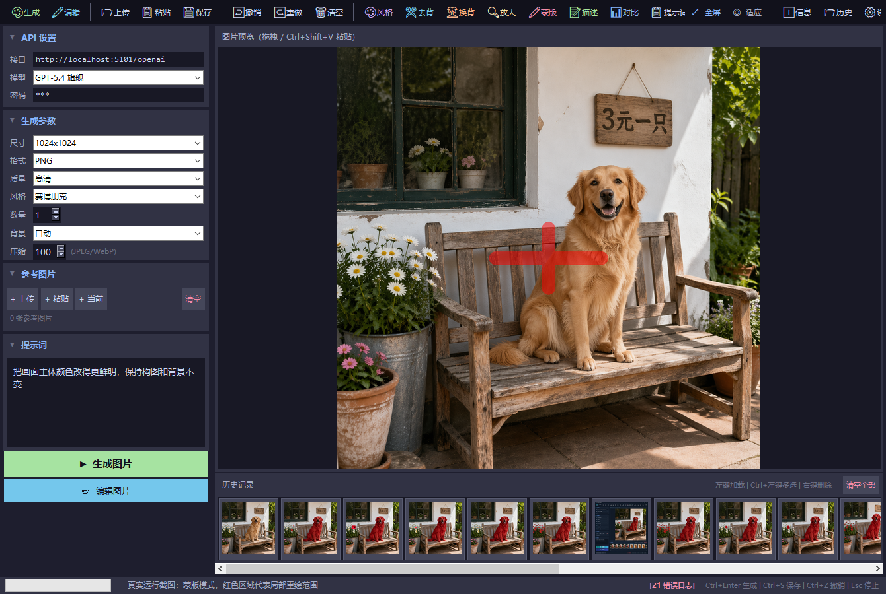

<div align="center">

# GPT 图片生成器

**Windows 桌面端 AI 图片生成与编辑工具**

基于 OpenAI 兼容接口，集成文生图、智能编辑、蒙版局部重绘、去背/换背、放大、风格预设、批量生成、历史记录与多参考图工作流。

[](https://www.python.org/)
[](./LICENSE)
[](https://www.microsoft.com/windows)
[](https://docs.python.org/3/library/tkinter.html)

</div>

---

## 目录

- [项目定位](#项目定位)
- [截图](#截图)
- [核心功能](#核心功能)
- [详细功能说明](#详细功能说明)
  - [图片生成与编辑](#图片生成与编辑)
  - [蒙版局部重绘](#蒙版局部重绘)
  - [背景处理](#背景处理)
  - [风格预设与自动风格](#风格预设与自动风格)
  - [批量生成](#批量生成)
  - [图片放大](#图片放大)
  - [AI 描述](#ai-描述)
  - [前后对比](#前后对比)
  - [撤销与重做](#撤销与重做)
  - [历史记录](#历史记录)
  - [全屏查看器](#全屏查看器)
  - [拖拽与粘贴](#拖拽与粘贴)
  - [智能模式切换](#智能模式切换)
  - [深色主题](#深色主题)
- [支持的模型](#支持的模型)
- [风格预设列表](#风格预设列表)
- [快捷键](#快捷键)
- [工具栏按钮](#工具栏按钮)
- [右侧参数面板](#右侧参数面板)
- [配置说明](#配置说明)
- [环境要求与安装](#环境要求与安装)
- [打包 EXE](#打包-exe)
- [项目结构](#项目结构)
- [开发说明](#开发说明)
- [已知边界](#已知边界)
- [License](#license)

---

## 项目定位

这是一个偏生产力取向的桌面应用，不是一个 SDK。重点在于把常见的图像生成与编辑动作串成一条顺手的桌面工作流：

- 单图生成与流式逐帧预览
- 基于当前主图进行编辑
- 蒙版局部重绘（含笔刷大小调节、区域分析、AI 引导）
- 多参考图协同编辑
- 去背、换背、自动换背
- AI 描述图片内容
- 前后对比
- 撤销 / 重做
- 历史记录与缩略图缓存
- 批量生成
- 风格预设与自动风格
- 图片放大
- 拖拽导入、剪贴板导入
- 全屏查看器（缩放、平移、适应窗口）
- 深色主题

项目当前是 Windows 优先，主程序仍是单文件 `gpt_image_app.py`，但仓库结构已经按开源项目常见形态整理过。

---

## 截图

### 主界面



### 工作区



### 蒙版模式



---

## 核心功能

| 类别 | 功能 | 说明 |
|:---|:---|:---|
| 生成 | 文生图 | 输入文字描述，流式逐帧预览生成结果 |
| 生成 | 批量生成 | 一次并发生成 1-10 张图片，完成后勾选保留 |
| 编辑 | 单图编辑 | 基于当前主图 + 文字指令进行编辑 |
| 编辑 | 多图编辑 | 主图 + 多张参考图 + 文字指令协同编辑 |
| 编辑 | 蒙版局部重绘 | 涂抹指定区域，AI 只修改蒙版区域 |
| 编辑 | 图片放大 | AI 超分辨率放大 |
| 背景 | 去背 | 一键移除背景，输出 PNG 透明图 |
| 背景 | 换背 | 输入新背景描述，一次性替换背景 |
| 背景 | 自动换背 | 开启后每次生成/编辑自动替换背景 |
| 风格 | 风格预设 | 12 种内置风格，追加到提示词后缀 |
| 风格 | 自动风格 | 开启后每次生成/编辑自动追加风格后缀 |
| 辅助 | AI 描述 | 调用 AI 分析图片内容，可复制到提示词 |
| 辅助 | 前后对比 | 并排显示修改前后图片，支持缩放/平移/全屏 |
| 辅助 | 撤销/重做 | 图片和蒙版各自独立的撤销/重做栈（最大30步） |
| 辅助 | 历史记录 | 自动保存所有生成结果，支持浏览/搜索/批量操作 |
| 视图 | 全屏查看器 | 缩放5%-2000%、平移、适应窗口、1:1原始大小、F11无边框 |
| 视图 | 深色主题 | 全套深色配色方案 |
| 导入 | 拖拽导入 | 支持拖拽文件到画布或编辑区 |
| 导入 | 剪贴板粘贴 | Ctrl+V 粘贴图片（文本框内保留正常文字粘贴） |
| 导入 | 上传文件 | 通过文件选择对话框上传图片 |

---

## 详细功能说明

### 图片生成与编辑

- **文生图**：输入文字描述，调用 AI 接口生成图片，支持流式逐帧预览（SSE），生成过程中可实时看到图片逐渐清晰
- **单图编辑**：在编辑区放入一张主图，输入编辑指令（如"把背景改成蓝色"），AI 基于原图进行修改
- **多图编辑**：主图 + 多张参考图同时作为输入，AI 综合所有图片和文字指令进行编辑
- **智能模式切换**：程序根据编辑区状态自动判断当前是"生成模式"、"编辑模式"还是"合成模式"，无需手动切换
- **响应链（response_id）**：保存 `previous_response_id`，支持迭代式连续编辑，AI 能理解前几轮的上下文
- **revised_prompt 显示**：生成完成后显示 AI 实际理解和使用的提示词，方便调试

### 蒙版局部重绘

- **涂抹蒙版**：进入蒙版模式后，在画布上左键涂抹，半透明红色显示蒙版区域
- **笔刷大小**：默认 20px，用 `[` / `]` 键实时调整，范围 4-200px
- **清除蒙版**：`Delete` 键清除所有涂抹
- **独立撤销/重做**：蒙版有独立的撤销/重做栈（最大30步），不影响图片撤销
- **蒙版区域分析**：程序自动分析蒙版的位置、范围，生成位置描述文本辅助 AI 理解
- **蒙版参考图**：自动生成一张在原图上标记蒙版区域的定位图（仅 responses 路线）
- **蒙版焦点裁剪**：自动裁剪蒙版区域并放大，帮助 AI 看清细节（仅 responses 路线）
- **作用域推断**：根据提示词自动判断是"局部编辑"还是"全局编辑"，生成对应的保护指令
- **退出保留**：退出蒙版模式时蒙版不丢失，下次生成时自动执行局部编辑

### 背景处理

- **去背**：一键移除图片背景，自动输出 PNG 格式透明图
- **换背**：弹出对话框输入新背景描述（默认"阳光海滩，海浪拍岸"），一次性替换背景
- **自动换背**：开启后，每次生成/编辑完成后自动执行换背操作，形成链式工作流

### 风格预设与自动风格

- **12 种内置风格**：无（原始）、水彩画、油画、像素艺术、赛博朋克、日式动漫、水墨画、素描、波普艺术、低多边形、梵高风格、宫崎骏风格
- **风格预设**：在右侧面板选择风格，生成时自动追加对应的后缀到提示词
- **自动风格**：点击工具栏"风格"按钮开启，每次生成/编辑后自动追加风格后缀并重新生成
- **链式执行**：自动风格和自动换背可以同时开启，按"风格→换背"顺序链式执行

### 批量生成

- 支持 1-10 张并发生成
- 每个批次项独立重试，最大重试次数限制
- 生成完成后弹出选择对话框，勾选要保留的图片
- 选中项自动加入历史记录
- 批量进度实时更新

### 图片放大

- 调用 AI 接口进行超分辨率放大
- 自动生成"Upscale this image..."提示词

### AI 描述

- 调用 `/responses` API 让 AI 分析图片内容
- 结果可一键复制到提示词输入框
- 方便对已有图片进行二次编辑

### 前后对比

- 首次点击"对比"记录当前图片为基准
- 并排显示"修改前"和"修改后"
- 各自支持缩放、平移、适应窗口、全屏查看
- 支持多张输入图合成一张基准联络图

### 撤销与重做

- 图片撤销/重做栈，最大30步
- 蒙版撤销/重做栈，独立于图片，最大30步
- 蒙版模式下撤销/重做按钮自动切换为"撤蒙"/"重蒙"
- 编辑、粘贴、清空等操作前自动压栈

### 历史记录

- 每次生成/编辑成功后自动保存到历史
- 右侧面板显示历史缩略图列表
- 单击浏览，双击加入编辑区
- 右键菜单：设为主图、添加为参考图、全屏查看、删除
- Ctrl+点击多选，支持批量添加/删除
- 支持选择性清空：仅记录 / 记录+文件
- 自动清理失效记录（文件已删除的条目）
- 缩略图缓存，快速加载

### 全屏查看器

- 滚轮缩放，范围 5%-2000%，向鼠标位置缩放
- 左键拖拽平移
- 适应窗口按钮
- 1:1 原始大小按钮
- F11 切换无边框全屏
- 双击画布/参考图/历史图打开全屏

### 拖拽与粘贴

- **拖拽导入**：支持拖拽文件到画布或编辑区（依赖 tkinterdnd2，缺失时降级为无拖拽模式）
- **剪贴板粘贴**：Ctrl+V 在非文本区域粘贴图片；在文本输入框（网址、密码、提示词等）中保留正常文字粘贴行为
- **Ctrl+Shift+V**：始终触发图片粘贴

### 智能模式切换

程序根据编辑区状态自动判断当前工作模式：

| 编辑区状态 | 模式 | 行为 |
|:---|:---|:---|
| 无图片 | 生成模式 | 纯文字生成 |
| 有主图，无参考图 | 编辑模式 | 单图编辑 |
| 有主图 + 参考图 | 合成模式 | 多图协同编辑 |

### 深色主题

- 全套深色配色方案，覆盖所有控件
- 工具栏按钮使用语义化颜色（生成=绿、停止=红、风格=紫、去背=橙等）

---

## 支持的模型

| 模型 ID | 说明 |
|:--------|:-----|
| `gpt-image-2` | 最新模型（默认） |
| `gpt-image-1.5` | 中等版本 |
| `gpt-image-1` | 基础版本 |
| `gpt-image-1-mini` | 轻量版本，速度更快 |

- 模型列表由 `config.json` 的 `model_options` 字段控制，可在 JSON 中增删
- UI 下拉框为只读，只能选不能手输
- 程序会自动纠正常见拼写错误（如 `gptimage2` → `gpt-image-2`）
- API 路线自动选择：`gpt-image-*` 系列走 `/images/edits`，其他走 `/responses`

---

## 风格预设列表

| 预设名称 | 追加到提示词的后缀 |
|:---------|:------------------|
| 无（原始） | （不追加） |
| 水彩画 | `in watercolor painting style, soft brush strokes, paper texture` |
| 油画 | `in oil painting style, rich impasto, canvas texture, classical technique` |
| 像素艺术 | `in pixel art style, 16-bit retro game aesthetic, crisp pixels` |
| 赛博朋克 | `in cyberpunk style, neon lights, dark futuristic cityscape, holographic` |
| 日式动漫 | `in Japanese anime style, cel-shaded, vibrant colors, detailed eyes` |
| 水墨画 | `in Chinese ink wash painting style, monochrome, rice paper, elegant brushwork` |
| 素描 | `in pencil sketch style, cross-hatching, graphite on white paper` |
| 波普艺术 | `in pop art style, bold colors, Ben-Day dots, comic book aesthetic` |
| 低多边形 | `in low-poly 3D style, geometric facets, clean edges, gradient lighting` |
| 梵高风格 | `in Van Gogh post-impressionist style, swirling brushstrokes, vivid colors` |
| 宫崎骏风格 | `in Studio Ghibli style, lush nature, whimsical, hand-painted backgrounds` |

---

## 快捷键

### 全局快捷键

| 快捷键 | 功能 |
|:-------|:-----|
| `Ctrl + Enter` | 生成图片 |
| `Ctrl + S` | 保存当前图片 |
| `Ctrl + Shift + S` | 保存当前图片 |
| `Ctrl + O` | 上传图片 |
| `Ctrl + Shift + O` | 上传图片 |
| `Ctrl + V` | 粘贴（文本框内=文字粘贴，非文本区域=图片粘贴） |
| `Ctrl + Shift + V` | 粘贴图片（始终触发图片粘贴） |
| `Ctrl + Z` | 撤销 |
| `Ctrl + Shift + Z` | 撤销 |
| `Ctrl + Y` | 重做 |
| `Ctrl + Shift + Y` | 重做 |
| `Esc` | 停止生成 / 退出蒙版 / 返回编辑区 |

### 蒙版模式快捷键

| 快捷键 | 功能 |
|:-------|:-----|
| `[` | 缩小蒙版笔刷（-5px） |
| `]` | 放大蒙版笔刷（+5px） |
| `Delete` | 清除蒙版涂抹 |

### 全屏查看器快捷键

| 快捷键 | 功能 |
|:-------|:-----|
| `F11` | 切换无边框全屏 |
| 滚轮 | 缩放（5%-2000%） |
| 左键拖拽 | 平移 |
| 双击 | 打开全屏查看 |

---

## 工具栏按钮

| 按钮 | 图标 | 功能 | 生成中可用 |
|:-----|:-----|:-----|:----------|
| 生成 | 🎨 | 开始生成/编辑 | 否 |
| 上传 | 📂 | 上传图片文件 | 否 |
| 粘贴 | 📋 | 从剪贴板粘贴图片 | 否 |
| 保存 | 💾 | 保存当前图片 | 否 |
| 撤销 | ↩ | 撤销上一步 | 否 |
| 重做 | ↪ | 重做 | 否 |
| 清空 | 🗑 | 清空画布 | 否 |
| 停止 | ⛔ | 停止当前生成 | **是** |
| 风格 | 🔁 | 开启/关闭自动风格 | 否 |
| 去背 | ✂ | 移除背景 | 否 |
| 换背 | 🏖 | 替换背景 | 否 |
| 自换背 | 🔁 | 开启/关闭自动换背 | 否 |
| 放大 | 🔍 | AI 超分辨率放大 | 否 |
| 蒙版 | ✏ | 进入/退出蒙版模式 | 否 |
| 描述 | 📝 | AI 描述图片内容 | 否 |
| 对比 | 📊 | 前后对比 | 否 |
| 提示词 | 📋 | 显示 AI 实际使用的提示词 | **是** |
| 全屏 | ⌢ | 全屏查看 | **是** |
| 适应 | ◯ | 适应窗口 | **是** |
| 信息 | ℹ | 图片详细信息 | **是** |
| 历史 | 📁 | 打开历史文件夹 | **是** |
| 设置 | ⚙ | 展开/收起设置面板 | **是** |

---

## 右侧参数面板

| 参数 | 控件类型 | 选项 | 默认值 | 说明 |
|:-----|:---------|:-----|:-------|:-----|
| API 地址 | 文本输入 | 自由输入 | `http://localhost:5101/v1` | OpenAI 兼容接口根地址 |
| 模型 | 只读下拉 | 由 `model_options` 控制 | `gpt-image-2` | 只能选不能手输 |
| 密码 | 密码输入 | 自由输入（显示为 *） | 空 | 接口鉴权内容 |
| 尺寸 | 可编辑下拉 | 按原图尺寸 + 20种预设 | 按原图尺寸 | 宽高需为16的倍数，宽高比≤3:1 |
| 格式 | 只读下拉 | PNG / JPEG / WebP | PNG | 输出图片格式 |
| 质量 | 只读下拉 | 自动 / 低 / 中 / 高 | 高 | 生成质量 |
| 风格 | 只读下拉 | 12种预设 | 无（原始） | 风格预设 |
| 数量 | 数字输入 | 1-10 | 1 | 批量生成数量 |
| 压缩 | 数字输入 | 1-100 | 100 | JPEG/WebP 压缩质量（100=无损） |

### 尺寸预设

| 类别 | 可选尺寸 |
|:-----|:---------|
| 正方形 | 1024×1024, 1536×1536, 2048×2048, 2880×2880 |
| 横向 | 1024×768, 1280×720, 1280×960, 1536×1024, 2048×1152, 2048×1536, 2560×1440, 3840×2160 |
| 纵向 | 768×1024, 720×1280, 960×1280, 1024×1536, 1024×1792, 1152×2048, 1440×2560, 2160×3840 |

尺寸规则：宽高需为 16 的倍数，宽高比不超过 3:1，总像素范围 655360~8294400。

---

## 配置说明

### 配置文件

- `config.example.json`：示例配置（不含密钥，提交到仓库）
- `config.json`：本地配置（含密钥，被 `.gitignore` 忽略，不提交）

如果本地没有 `config.json`，程序第一次启动会自动写入默认配置。

### 配置字段

| 字段 | 说明 | 默认值 |
|:-----|:-----|:-------|
| `api_base` | OpenAI 兼容接口根地址 | `http://127.0.0.1:5101/v1` |
| `model` | 当前选中的模型 | `gpt-image-2` |
| `model_options` | UI 下拉中可选的模型列表 | `["gpt-image-2", "gpt-image-1.5", "gpt-image-1", "gpt-image-1-mini"]` |
| `auth` | 接口鉴权内容 | `""` |
| `size` | 默认输出尺寸 | `"1024x1024"` |
| `format` | 默认输出格式 | `"png"` |
| `quality` | 默认质量 | `"high"` |
| `style` | 默认风格预设 | `"无（原始）"` |
| `batch` | 默认批量数量 | `1` |
| `compression` | JPEG/WebP 压缩质量 | `100` |

### 配置自动保存

所有配置变量绑定 `trace_add("write")` 回调，变更后 500ms 防抖自动保存到 `config.json`。

### API 路线与重试

| 路线 | 用途 |
|:-----|:-----|
| `/responses`（SSE 流式） | 主要生成/编辑路线 |
| `/responses`（非流式） | 流式失败后的降级回退 |
| `/images/edits`（multipart） | 蒙版编辑路线（gpt-image-* 系列模型） |

**重试策略**：
- 最多 5 次重试
- 第 2 次起移除 `previous_response_id`
- 第 3 次起激进压缩输入图片
- 502/503/429 错误：指数退避+抖动，降级到非流式
- 请求体 > 4096KB 时：首次尝试前主动压缩

---

## 环境要求与安装

### 环境要求

- Windows 10/11
- Python 3.10+
- 可访问的 OpenAI 兼容图片接口

`tkinter` 通常随标准 Python 一起安装；拖拽依赖 `tkinterdnd2`，缺失时程序会降级为无拖拽模式。

### 安装步骤

#### 1. 安装依赖

```bash
pip install -r requirements.txt
```

依赖列表：
- `requests >= 2.28` — HTTP 请求
- `httpx >= 0.24` — 异步 HTTP 客户端
- `Pillow >= 9.0` — 图片处理
- `tkinterdnd2 >= 0.3` — 拖拽支持（可选，缺失时降级）

#### 2. 生成本地配置

```bash
copy config.example.json config.json
```

然后编辑 `config.json`，填入你的接口地址和密码。

#### 3. 启动

```bash
python -m gpt_image_app
```

或者直接双击 [`启动.bat`](启动.bat)。

---

## 打包 EXE

项目包含 PyInstaller 规格文件：

```bash
pyinstaller GPT图片生成器.spec
```

这份 `.spec` 已去掉本机绝对路径依赖，改为在构建时动态定位 `tkinterdnd2/tkdnd` 资源。

---

## 项目结构

```text
gpt_image_app.py         主程序（~9200 行）
config.example.json      示例配置（不含密钥）
config.json              本地配置（含密钥，被 .gitignore 忽略）
requirements.txt         运行依赖
pyproject.toml           开源项目元数据
GPT图片生成器.spec        PyInstaller 打包配置
启动.bat                 Windows 快速启动脚本
docs/                    README 截图资源
  screenshot-main.png    主界面截图
  screenshot-mask.png    蒙版模式截图
  screenshot-workspace.png 工作区截图
LICENSE                  MIT 许可证
CONTRIBUTING.md          贡献说明
.editorconfig            编辑器风格统一
.gitattributes           Git 换行/语言属性
.gitignore               忽略规则
```

### 不应提交到 Git 的内容

这些内容属于运行期数据、构建产物或本机缓存，已经被 `.gitignore` 忽略：

- `config.json` — 含用户密钥和本地配置
- `history/` — 运行时生成历史图片
- `thumbs/` — 运行时缩略图缓存
- `history_db.json` — 历史记录数据库
- `debug_payloads/` — 调试请求记录
- `debug_log.json` — 调试日志
- `error_log.json` — 错误日志
- `_tmp/` — 临时调试文件
- `build/` — PyInstaller 构建产物
- `dist/` — 打包输出（含 exe）
- `__pycache__/` — Python 编译缓存
- `.pytest_cache/` — 测试缓存

---

## 开发说明

### 最低限度检查

修改完代码后，至少执行：

```bash
python -m py_compile gpt_image_app.py
```

如果你改了打包链路，再额外跑一次：

```bash
pyinstaller GPT图片生成器.spec
```

### 提交前建议

- 不提交本地配置、日志、历史记录、缩略图和打包产物
- 修改功能时同步更新 `README.md` 和 `config.example.json`
- 如果改了快捷键、模型、配置字段或打包流程，优先更新文档

更多协作约定见 [`CONTRIBUTING.md`](CONTRIBUTING.md)。

---

## 已知边界

- 当前主要面向 Windows，未针对 macOS / Linux 做系统级验证
- 主程序仍以单文件形态维护（~9200 行），后续如果要长期多人协作，建议逐步拆分模块
- 仓库现在适合开源发布和问题追踪，但还不是完整的 Python 包生态项目
- 没有自动化测试（`tests/` 目录）和 CI/CD（GitHub Actions）

---

## License

本项目使用 [MIT License](LICENSE)。
